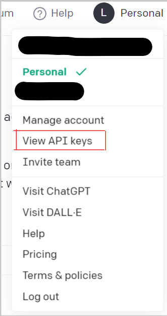
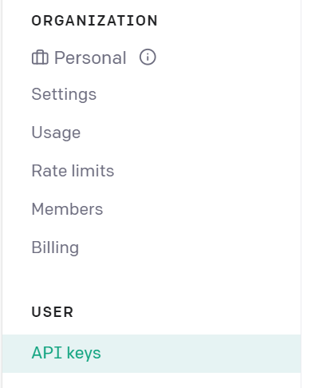
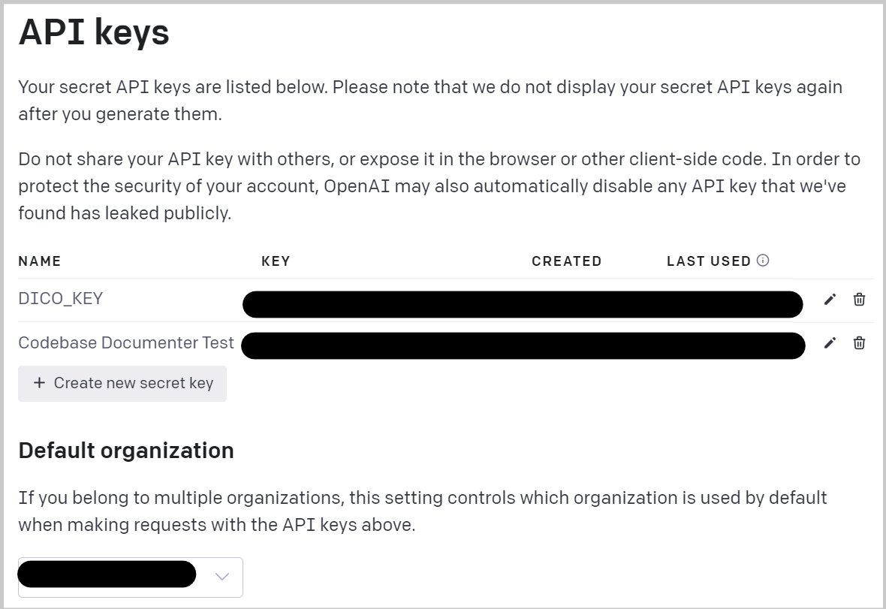
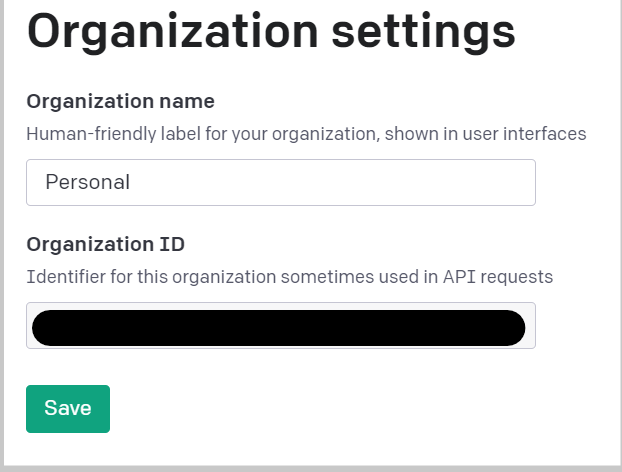

# Récupérer sa clé API et son ID d'organisation

Sur le site [OpenAI Hub](https://platform.openai.com/overview)

Dans le menu de votre compte, vous accéder à la rubrique "View API keys"

Vous êtes redirigé vers le panel de gestion d'API:

## Clé API
Dans la section USER.API_keys vous pouvez créer une nouvelle clé que vous devrez copier puis coller dans votre fichier .env associé à la variable OPENAI_API_KEY comme montré dans le fichier .env.template.

## ID organisation
La clé d'organisation se récupère dans la section ORGANIZATION."nom de l'organisation".Settings.
Elle ne change jamais, vous la copiez et vous l'associez à la variable OPENAI_ORG_ID.

