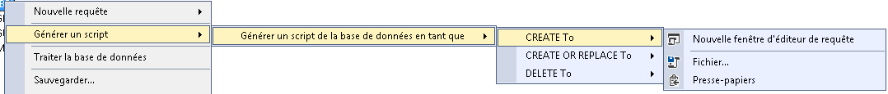

# Récupérer le fichier XMLA de votre cube

Dans MS SQL SERVER accéder à l'emplacement de vos cubes multidimensionnelle ou tabulaire puis faites un clic droit sur la base de donnée qui héberge votre cube comme suit :



Une fois que vous avez cliqué sur "Nouvelle fenêtre d'éditeur de requête" ou sur "Fichier" vous obtenez un fichier .xmla qui sera la source à partir de laquelle on va reconstituer le dictionnaire de donnée du cube.

## Tabulaire

Pour le tabulaire le fichier xmla sera sous forme de dictionnaire {...} ce qui est pris en charge par la classe extract_from_xmla.ExtractorTabularCubeCatalog

## Multidim

Pour le multidimensionnelle le fichier xmla sera sous forme de balise xml. Lors de la génération du fichier il peut manquer cette balise au début du fichier:
 
````xml
<?xml version="1.0" ?>
````
Vous devez l'implémenter sinon le module xml.etree.ElementTree dans extract_from_xmla.ExtractorMultidimCubeCatalog ne pourra pas lire le fichier xmla.